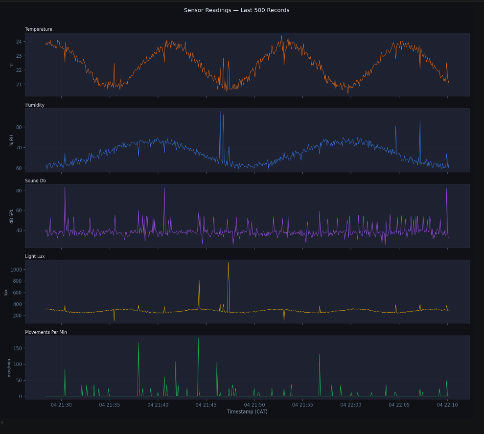
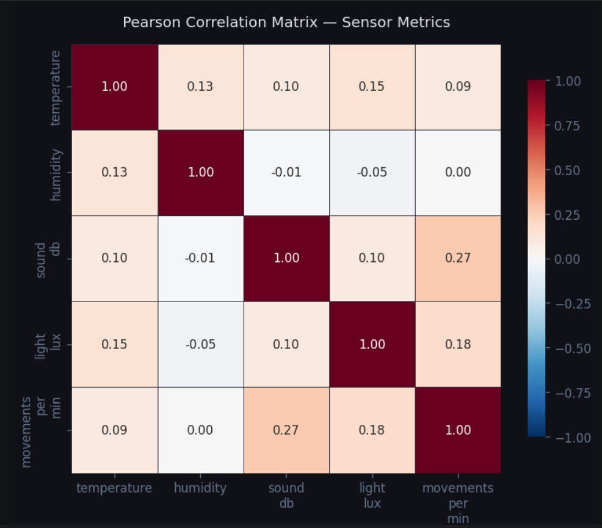
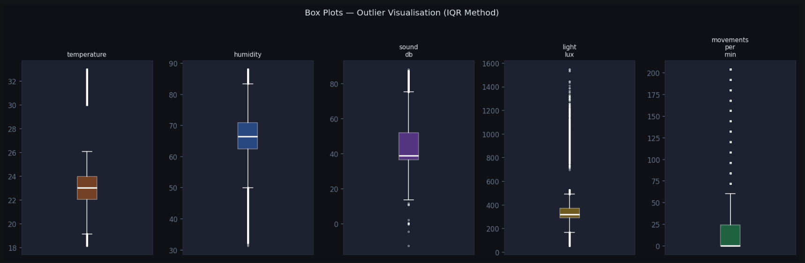
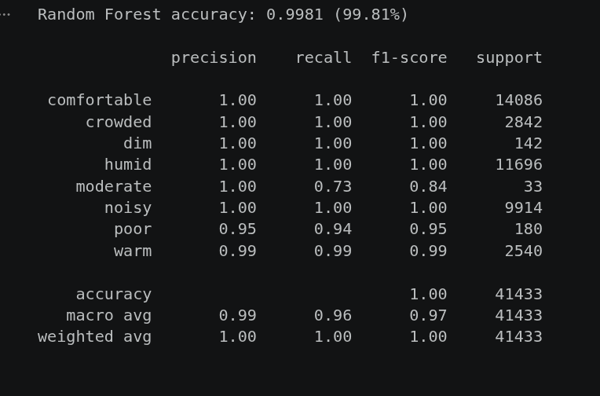
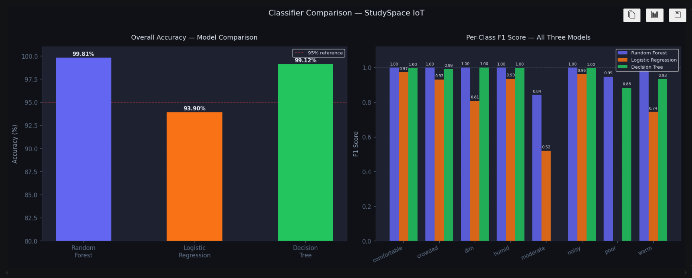
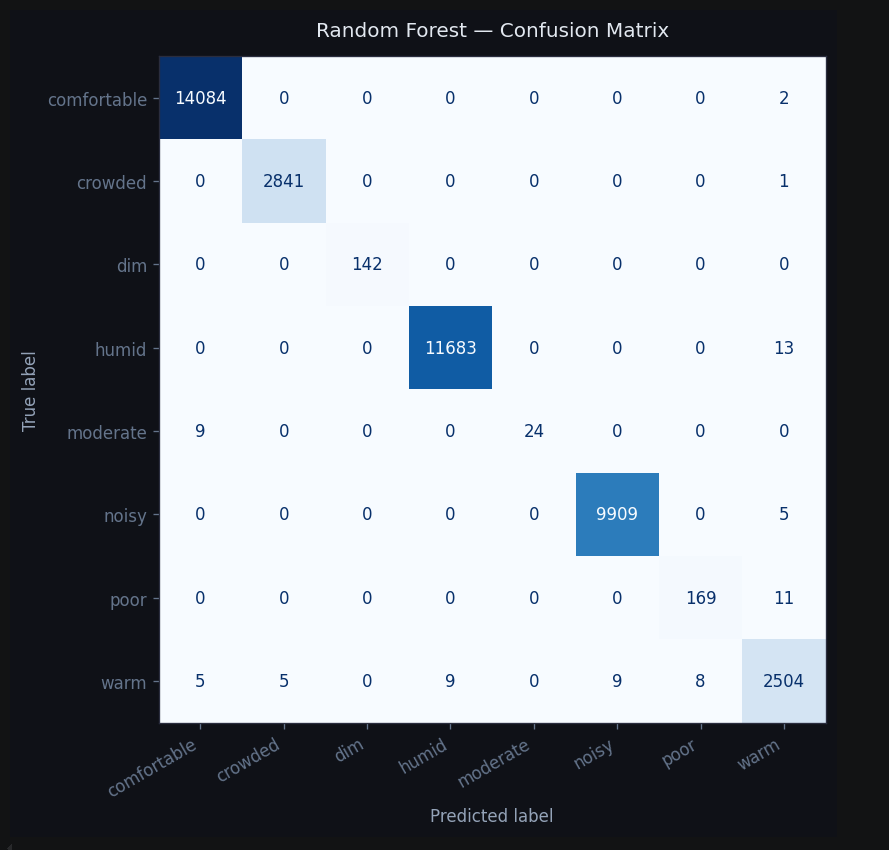
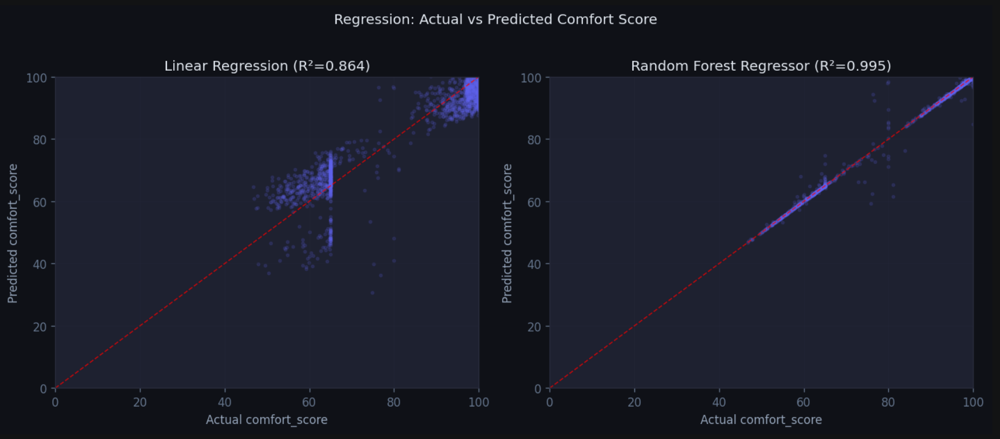

# StudySpace IoT — Analysis Pipeline


> End-to-end walkthrough of `studyspace_analysis.ipynb` — from raw sensor readings in PostgreSQL to trained models that power the dashboard.

---

## The Big Picture

```
PostgreSQL  →  Clean  →  Normalise  →  Analyse  →  Train  →  Save .pkl
   (raw)                                          classifiers  (dashboard)
                                                  regressors
```

The notebook runs **top to bottom once**. The last cell writes two files to `../backend/models/` that the Insights page loads for live predictions.

---

## Steps

### 1. Load Data from PostgreSQL

Pulls all sensor readings with a `WHERE` filter to ensure no NULL sensor values. Uses `psycopg2` (synchronous driver) because `pandas.read_sql` is synchronous — not the `asyncpg` driver the FastAPI backend uses.

**Output:** a DataFrame with 230K+ rows covering temperature, humidity, sound, light, movement, comfort score, and label.

---

### 2. Summary Statistics

Calculates mean, min, max, standard deviation, and **CV%** for each sensor.

> **CV% (Coefficient of Variation)** = `std / mean × 100`
> It's a normalised measure of how "jumpy" a metric is regardless of its scale.
> `movements_per_min` having CV%=196 is expected — rooms switch between empty and busy.

---

### 3. Label Distribution

Shows how many readings belong to each comfort class and what percentage each class makes up.

The eight classes: `comfortable`, `humid`, `noisy`, `crowded`, `warm`, `moderate`, `dim`, `poor`.

> These labels come from the backend's rule engine running in real time — not from manual tagging.

---

### 4. Data Cleaning

- Drops rows with any missing sensor value
- Adds time features: `hour`, `weekday` (0=Mon, 6=Sun), `is_weekday`
- Encodes labels as integers for ML (`comfortable=0, crowded=1, dim=2...` — alphabetical order)

**Sample output after cleaning:**

| timestamp | hour | weekday | is_weekday | label | label_enc |
|---|---|---|---|---|---|
| 2026-04-22 23:39 | 23 | 2 | 1 | noisy | 5 |

---

### 5. Normalisation

Scales all five sensor features to the range **[0, 1]** using Min-Max scaling:

```
x_scaled = (x − x_min) / (x_max − x_min)
```

**Why?** Some ML algorithms treat big numbers as more important. A humidity of 70 and a movement count of 70 mean very different things. Scaling removes that bias.

**Why fit once?** The scaler memorises the min/max from training data. At prediction time, new readings are scaled using those same boundaries — otherwise predictions would be inconsistent.

| | temperature | humidity | sound_db | light_lux | movements |
|---|---|---|---|---|---|
| Before | 18–33 °C | 32–88 % | −12–87 dB | 75–1547 lux | 0–204 /min |
| After | 0–1 | 0–1 | 0–1 | 0–1 | 0–1 |

---

### 6. Time-Series Visualisation

Plots the last 500 readings for each sensor over time — a sanity check to confirm sensors are behaving as expected before training begins.



---

### 7. Correlation Analysis

A heatmap of **Pearson correlation** between all five sensors.

> **Correlation (r)** measures how much two metrics move together.
> - r close to +1 → they rise and fall together
> - r close to −1 → when one rises, the other falls
> - r close to 0 → no relationship



---

### 8. Data Augmentation

If real labelled data is below 50K rows, the notebook bootstraps to 200K by resampling with replacement and adding ±2% Gaussian noise — keeping the label distribution intact.

With 207K+ real rows, augmentation is skipped automatically.

---

### 9. Outlier Detection (IQR Method)

Flags readings outside the **Tukey fences**:

```
Lower fence = Q1 − 1.5 × IQR
Upper fence = Q3 + 1.5 × IQR
```

> **IQR** = the middle 50% of data (Q3 − Q1). Anything beyond 1.5× that range is an outlier.
> This matches how the backend generates anomaly alerts.



~11% of readings are flagged. The clean dataset (outliers removed) is used for regression.

---

## Classification — Which Room Condition?

Three models all learn from the same data: 5 sensor features → 1 of 8 labels.

### Model 1 — Random Forest

Think of it as **a committee of 100 referees**. Each referee is a decision tree that votes for a label. The majority vote wins. Confidence = fraction of trees that agreed.

- Best accuracy: **99.81%**
- Provides feature importances (which sensor mattered most)
- Selected as the production model



### Model 2 — Logistic Regression

Like a **market vendor with a weighing scale** — multiplies each sensor reading by a learned weight, adds them up, then uses the sigmoid function to turn that sum into probabilities for each class. The highest probability wins.

- Accuracy: **93.90%**
- Fast and interpretable, but assumes linear relationships

### Model 3 — Decision Tree

Like a **triage nurse** asking yes/no questions: "Is sound > 0.6? → yes → Is humidity > 0.7? → yes → label: humid." Up to 6 levels deep.

- Accuracy: **99.12%**
- Fully transparent — you can draw the exact rules it learned

---

### Model Comparison



| Model | Accuracy | RMSE |
|---|---|---|
| Random Forest | 99.81% | — |
| Logistic Regression | 93.90% | — |
| Decision Tree | 99.12% | — |

**Feature importances (Random Forest):**

| Sensor | Share |
|---|---|
| humidity | 42.7% |
| sound_db | 30.9% |
| movements_per_min | 13.7% |
| temperature | 10.3% |
| light_lux | 2.5% |

These percentages appear directly on the dashboard's Insights page.

---

### Confusion Matrix

A grid where rows = actual label, columns = predicted label. The diagonal = correct predictions. Everything off the diagonal = mistakes.



With 99.81% accuracy, nearly all predictions sit on the diagonal. The tiny off-diagonal numbers are mostly in rare classes (`moderate`, `poor`) — classes with very few training examples.

---

### Rule vs ML Agreement

The backend labels data with hand-written rules. The Random Forest independently learned from that data. Agreement between the two: **99.87%**.

This validates both systems — the ML found the same logic the rules encode, purely from patterns in the data.

---

## Regression — What Is the Comfort Score?

Two models predict `comfort_score` (0–100) as a continuous number.

### Linear Regression

Fits one equation:
```
comfort_score = w₁×temperature + w₂×humidity + w₃×sound_db + w₄×light_lux + w₅×movements + b
```
Coefficients learned from data — all negative (every sensor going up hurts comfort). Sound hurts the most (−114).

- R² = 0.81, RMSE = 7.4 points

### Random Forest Regressor

100 trees each predict a number. Final prediction = average of all 100. Captures non-linear patterns a straight line misses.

- R² = 0.978, RMSE = 2.5 points — off by only ~2.5 comfort points on average

> **R²** = how much of the variation in comfort scores the model explains (1.0 = perfect).
> **RMSE** = average prediction error in the same units as the target (comfort score points).



Dots tight on the diagonal = good. The Random Forest plot is nearly perfect. The Linear Regression plot curves at the extremes — the straight-line assumption breaks down for very low and very high comfort scores.

---

## Saving Models

```python
joblib.dump(rf_clf,  '../backend/models/comfort_classifier.pkl')   # classifier
joblib.dump(scaler,  '../backend/models/feature_scaler.pkl')        # normaliser
```

Both files are required:
- **`comfort_classifier.pkl`** — the trained Random Forest. The backend calls `.predict()` on new readings.
- **`feature_scaler.pkl`** — the fitted scaler. New readings must be normalised with the same min/max values used during training, otherwise predictions are garbage.

---

## Running the Notebook

```bash
cd analysis
pip install -r requirements.txt
jupyter notebook studyspace_analysis.ipynb
```

Run all cells top to bottom. The database must be running and populated before cell 3.
